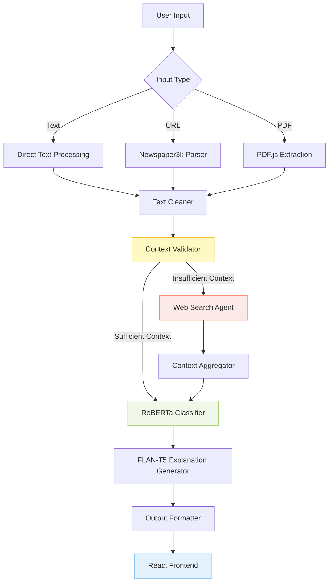

# InformaTruth: AI-Driven News Authenticity Analyzer
[](https://github.com/Md-Emon-Hasan/InformaTruth/actions) [](https://python.org) [](https://pytorch.org/) [](https://huggingface.co/) [](https://python.langchain.com/) [](https://scikit-learn.org/) [](https://pandas.pydata.org/) [](https://fastapi.tiangolo.com) [](https://www.docker.com/)   

InformaTruth is an end-to-end AI-powered multi-agent fact-checking system that automatically verifies news articles, PDFs, and web content. It leverages RoBERTa fine-tuning, LangGraph orchestration, RAG pipelines, and fallback retrieval agents to deliver reliable, context-aware verification. The system features a modular multi-agent architecture including Planner, Retriever, Generator, Memory, and Fallback Agents, integrating diverse tools for comprehensive reasoning.

It achieves ~70% accuracy and F1 ~69% on the LIAR dataset, with 95% query coverage and ~60% improved reliability through intelligent tool routing and memory integration. Designed for real-world deployment, InformaTruth includes a Flask-based responsive UI, FastAPI endpoints, Dockerized containers, and a CI/CD pipeline, enabling enterprise-grade automated fact verification at scale.

[](https://github.com/user-attachments/assets/423ca9a1-caf1-405e-b671-be842d9a1240)

[](https://github.com/user-attachments/assets/1e6717bc-53a3-4848-80a8-252c4eae8f5b)
[](https://github.com/user-attachments/assets/187a8cc1-75dc-46c5-809a-8d88214797e4)

---

## Live Demo

**Try it now**: [InformaTruth — Fake News Detection AI App](https://informatruth.onrender.com)

---

## Tech Stack
| **Category**                | **Technology/Resource**                                                                                |
| --------------------------- | ------------------------------------------------------------------------------------------------------ |
| **Core Framework**          | PyTorch, Transformers, HuggingFace                                                                     |
| **Frontend Framework**      | **React.js** (Vite), Tailwind CSS, DaisyUI                                                             |
| **Backend Framework**       | **FastAPI** (Async, Pydantic)                                                                          |
| **Classification Model**    | Fine-tuned RoBERTa-base on LIAR Dataset                                                                |
| **Explanation Model**       | FLAN-T5-base (Zero-shot Prompting)                                                                     |
| **Training Data**           | LIAR Dataset (Political Fact-Checking)                                                                 |
| **Evaluation Metrics**      | Accuracy, Precision, Recall, F1-score                                                                  |
| **Training Framework**      | HuggingFace Trainer                                                                                    |
| **LangGraph Orchestration** | LangGraph (Multi-Agent Directed Acyclic Execution Graph)                                               |
| **Agents Used**             | PlannerAgent, InputHandlerAgent, ToolRouterAgent, ExecutorAgent, ExplanationAgent, FallbackSearchAgent |
| **Input Modalities**        | Raw Text, Website URLs (via Newspaper3k), PDF Documents (via PyMuPDF)                                  |
| **Tool Augmentation**       | DuckDuckGo Search API (Fallback), Wikipedia (Planned), ToolRouter Logic                                |
| **Web Scraping**            | Newspaper3k (HTML → Clean Article)                                                                     |
| **PDF Parsing**             | PyMuPDF (Backend) / PDF.js (Frontend)                                                                  |
| **Explainability**          | Natural language justification generated using FLAN-T5                                                 |
| **State Management**        | Shared State Object (LangGraph-compatible)                                                             |
| **Hosting Platform**        | Render (Docker)                                                                                        |
| **Version Control**         | Git, GitHub                                                                                            |
| **Logging & Debugging**     | Centralized Logs in `logs/` directory                                                                  |
| **Database**                | **SQLite** + **SQLModel** (Auto-persistence of analysis results)                                       |
| **Input Support**           | Text, URLs, PDF documents                                                                              |

---

## Key Features

* **Monolithic & Agentic Architecture**
  Strictly organized codebase following agentic principles with modular separation of concerns.

* **Modern React Frontend**
  A responsive, pixel-perfect UI built with **React**, **Vite**, and **Tailwind CSS**, featuring dark mode and glassmorphism design.

* **FastAPI Backend**
  High-performance asynchronous API handling automatic documentation and efficient model serving.

* **Multi-Format Input Support**
  Accepts raw **text**, **web URLs**, and **PDF documents** (with client-side text extraction).

* **Full NLP Pipeline**
  Integrates **fake news classification** (RoBERTa) and **natural language explanation** (FLAN-T5).

* **Modular Agent-Based Architecture**
  Built using **LangGraph** with modular agents: `Planner`, `Router`, `Executor`, and `Fallback`.

* **Explanation Generation**
  Uses **FLAN-T5** to generate human-readable rationales for model predictions.

* **Comprehensive Testing**
  Targeting 100% test coverage with automated unit and integration tests using `pytest` (Backend) and `vitest` (Frontend).

* **Structured Logging**
  All logs are automatically saved to the `logs/` directory for better debugging and monitoring.

---

## Project File Structure

```bash
InformaTruth/
│
├── .github/
│   └── workflows/
│       └── main.yml                  # CI/CD Configuration
│
├── backend/                          # FastAPI Backend
│   ├── app/                          # Application Package
│   │   ├── agents/                   # Modular Pipeline Agents
│   │   │   ├── executor.py
│   │   │   ├── fallback_search.py
│   │   │   ├── input_handler.py
│   │   │   ├── planner.py
│   │   │   └── router.py
│   │   ├── graph/                    # LangGraph Orchestration
│   │   │   ├── builder.py
│   │   │   └── state.py
│   │   ├── models/                   # AI Model Wrappers
│   │   │   ├── classifier.py
│   │   │   ├── db.py                 # Database Models
│   │   │   └── loader.py
│   │   ├── utils/                    # Shared Utilities
│   │   │   ├── logger.py
│   │   │   └── results.py
│   │   ├── db.py                     # Database Connection & Setup
│   │   └── main.py                   # FastAPI entry point
│   │   └── valid.tsv
│   ├── logs/                         # Application Logs
│   │   └── fake_news_pipeline.log
│   ├── news/                         # Sample Data
│   │   └── news.pdf
│   ├── tests/                        # Backend Tests
│   │   ├── conftest.py
│   │   ├── test_agents.py
│   │   ├── test_api.py
│   │   ├── test_db.py                # Database Integration Tests
│   │   ├── test_edge_cases.py
│   │   ├── test_lifespan.py
│   │   └── test_models.py
│   ├── train/                        # Training module
│   │   ├── config.py
│   │   ├── data_loader.py
│   │   ├── predictor.py
│   │   ├── run.py
│   │   ├── trainer.py
│   │   └── utils.py
│   ├── config.py                     # Global Configuration
│   ├── Dockerfile                    # Backend Dockerfile
│   ├── pyproject.toml                # Project Configuration
│   ├── requirements.txt              # Python dependencies
│   └── setup.py                      # Package Setup
│
├── frontend/                         # React Frontend
│   ├── public/                       # Static Assets
│   ├── src/                          # Source Code
│   │   ├── assets/                   # Images/Vectors
│   │   │   └── react.svg
│   │   ├── components/               # React Components
│   │   │   ├── AnalysisForm.jsx
│   │   │   ├── Footer.jsx
│   │   │   ├── Hero.jsx
│   │   │   ├── Navbar.jsx
│   │   │   └── ResultsParams.jsx
│   │   ├── App.jsx                   # Main App Component
│   │   ├── App.test.jsx              # Frontend Unit Tests
│   │   ├── index.css                 # Tailwind
│   │   ├── main.jsx                 
│   │   └── setupTests.js             
│   ├── Dockerfile                    # Frontend Dockerfile
│   ├── eslint.config.js            
│   ├── index.html                    # HTML Entry Point
│   ├── package-lock.json           
│   ├── package.json                 
│   └── vite.config.js                # Vite Configuration
│
├── docker-compose.yml                # Docker Orchestration
├── demo.mp4                          # Demo Video
├── demo-1.png                        # Demo Image
├── demo-2.png                        # Demo Image
├── LICENSE                           # Project License
├── README.md                         # Documentation
├── render.yml                        # Render Deployment Config
└── run.py                            # Root launch script
```

---

## Getting Started

### 1. Running the Application (Local Development)
To launch both the **FastAPI Backend** and **React Frontend** locally in parallel:
```bash
python run.py
```
- **Backend**: `http://localhost:8000`
- **Frontend**: `http://localhost:5173`

### 2. Running with Docker (Production/Containerized)
To build and run the entire stack using Docker Compose:
```bash
docker-compose up --build
```

### 3. Running Training
To trigger the model training process (ensure you are in `backend/`):
```bash
cd backend
python train/run.py
```

### 4. Running Tests
**Backend (Pytest):**
```bash
cd backend
python -m pytest tests/ --cov=app --cov-report=term-missing
```

**Frontend (Vitest):**
```bash
cd frontend
npm test
```

---

## System Architecture


---

## Model Performance
| Epoch | Train Loss | Val Loss | Accuracy | F1     | Precision | Recall  |
|-------|------------|----------|----------|--------|-----------|---------|
| 1     | 0.6353     | 0.6205   | 0.6557   | 0.6601 | 0.6663    | 0.6557  |
| 2     | 0.6132     | 0.5765   | 0.7032   | 0.6720 | 0.6817    | 0.7032  |
| 3     | 0.5957     | 0.5779   | 0.6970   | 0.6927 | 0.6899    | 0.6970  |
| 4     | 0.5781     | 0.5778   | 0.6978   | 0.6899 | 0.6864    | 0.6978  |
| 5     | 0.5599     | 0.5810   | 0.6954   | 0.6882 | 0.6846    | 0.6954  |

> Emphasis on **Recall** ensures the model catches most fake news cases.

---

## Professional Testing & Quality

### 1. Linting
**Backend (Ruff):**
```bash
cd backend
ruff check app/ tests/
```
**Frontend (ESLint):**
```bash
cd frontend
npm run lint
```

### 2. Code Formatting
**Backend (Black):**
```bash
cd backend
black app/ tests/
```

---

## CI/CD Pipeline (GitHub Actions)
The project utilizes a comprehensive **GitHub Actions** workflow for automated testing and validation.

### Workflow Features:
- **Backend**:
  - Sets up Python 3.11
  - Installs dependencies from `requirements.txt`
  - Runs **Ruff** for linting
  - Runs **Black** for formatting checks
  - Executs **Pytest** with coverage reporting
- **Frontend**:
  - Sets up Node.js 18
  - Installs dependencies (`npm ci`)
  - Runs **ESLint**
  - Executes **Vitest** unit tests
- **Docker**:
  - Builds `backend` and `frontend` Docker images upon successful tests

### Trigger
The pipeline runs automatically on every `push` and `pull_request` to the `main` branch.

---

## **Developed By**

**Md Emon Hasan**  
**Email:** emon.mlengineer@gmail.com
**WhatsApp:** [+8801834363533](https://wa.me/8801834363533)  
**GitHub:** [Md-Emon-Hasan](https://github.com/Md-Emon-Hasan)  
**LinkedIn:** [Md Emon Hasan](https://www.linkedin.com/in/md-emon-hasan-695483237/)  
**Facebook:** [Md Emon Hasan](https://www.facebook.com/mdemon.hasan2001/)

---

## License
MIT License. Free to use with credit.
