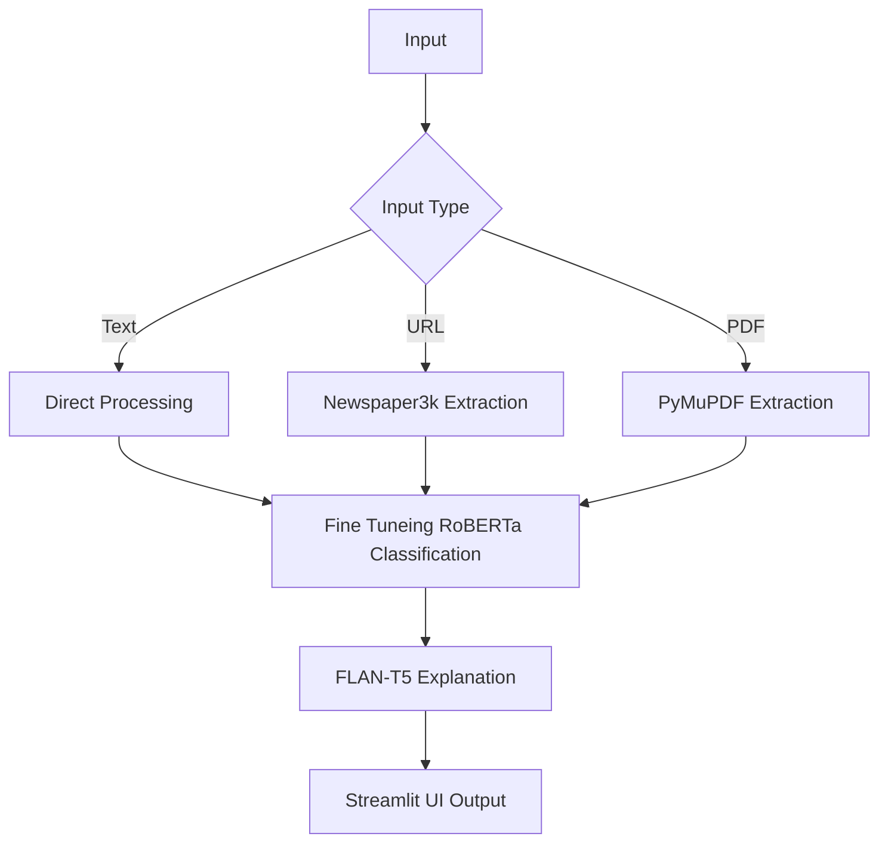

# 📘 InformaTruth: AI-Driven News Veracity Analyzer
This project addresses the challenge by fine-tuning a transformer-based classification model (RoBERTa) on the LIAR dataset to automatically determine whether a news statement is real or fake. Additionally, it employs a generative LLM (FLAN-T5) to produce natural language explanations for its predictions, increasing user trust and transparency in the system.

[](https://github.com/user-attachments/assets/42d5bc32-c739-4f5e-a8e6-9e89cc0a6e6e)
---

## 🔍 Overview
In the digital age, misinformation spreads rapidly across news outlets, social media, and online platforms. With the increasing difficulty of distinguishing between credible journalism and deceptive content, there is a growing demand for automated systems that can detect fake news efficiently and explain their reasoning. Manual fact-checking is time-consuming, prone to bias, and often fails to scale with the speed of information propagation. It also includes a user-friendly UI, Rest API, modular components and a complete Dockerized CI/CD pipeline for enterprise deployment.

---

## 🚀 Live Demo

🖥️ **Try it now**: [InformaTruth — Fake News Detection AI App](https://informatruth.onrender.com)

---

## ⚙️ Tech Stack
| **Category**               | **Technology/Resource**                                                                 |
|----------------------------|----------------------------------------------------------------------------------------|
| **Core Framework**         | PyTorch, Transformers                                                                  |
| **Classification Model**   | Fine-tuned RoBERTa-base                                                                |
| **Explanation Model**      | FLAN-T5-base                                                                           |
| **Training Data**          | LIAR Dataset (Political Fact-Checking)                                                 |
| **Evaluation Metrics**     | Accuracy, Precision, Recall, F1-score                                                 |
| **Text Extraction**       | Newspaper3k (URLs), PyMuPDF (PDFs)                                                    |
| **Training Framework**     | HuggingFace Trainer                                                                    |
| **Deployment**            | Streamlit (Web Interface)                                                             |
| **Hosting**               | Render                                                |
| **Input Support**         | Text, URLs, PDF documents                                                             |
| **Explainability**        | FLAN-T5 generated natural language explanations                                       |

---

### ✅ Key Features
- **Multi-format input**: Supports raw text, URLs, and PDF files.
- **NLP Pipeline**: Includes summarization, classification, and LLM-based explanation.
- **Moduler coding and logging**: Clean, modular code with logging.
- **Streamlit UI**: Clean, responsive frontend for interaction.
- **Rest API**: For integration with other systems.
- **Dockerized**: Fully containerized for production deployments.
- **CI/CD**: GitHub Actions pipeline for testing, linting, and Docker validation.

---

## 📦 Project Structure
```bash
InformaTruth/
├── src/
│   ├── config.py         # Configuration
│   ├── data.py           # Data handling
│   ├── inference.py      # Model inference
│   ├── main.py           # Main script
│   ├── model.py          # Model definition
│   └── loggger.py        # Logging
│
├── fine_tuned_liar_detector/  # Fine-tuned model
│
├── notebook/
│   └── experiment.ipynb  # Experimentation                                
│
├── test/
│   └── test_app.py
│
├── .github/              # GitHub Actions
│   └── workflows/
│       └── main.yml  
│
├── app.py                # Streamlit app
├── app.png               # Demo
├── demo.webm             # Demo video
├── setup.py              # Python setup file
├── Dockerfile            # Dockerfile
├── flask_api.py          # Rest API
├── requirements.txt      # Dependencies
├── .gitignore            # Git ignore file
├── LICENSE               # License
└── README.md             # This file
```

---

## 🧱 System Architecture


---

## 📊 Model Performance
| Epoch | Train Loss | Val Loss | Accuracy | F1     | Precision | Recall  |
|-------|------------|----------|----------|--------|-----------|---------|
| 1     | 0.3889     | 0.6674   | 0.7204   | 0.8285 | 0.7461    | 0.9313  |
| 2     | 0.4523     | 0.6771   | 0.7196   | 0.8259 | 0.7511    | 0.9173  |

> Emphasis on **Recall** ensures the model catches most fake news cases.

---

## 🐳 Docker Instructions
### Step 1: Build Docker image
```bash
docker build -t informa-truth-app .
```

### Step 2: Run Docker container
```bash
docker run -p 8501:8501 informa-truth-app
```

---

## ⚙️ CI/CD Pipeline (GitHub Actions)
The CI/CD pipeline automates code checks, Docker image building, and Streamlit app validation.

### Sample Workflow
```yaml
name: CI Pipeline
on: [push]
jobs:
  build:
    runs-on: ubuntu-latest
    steps:
      - name: Checkout repo
        uses: actions/checkout@v3

      - name: Setup Python
        uses: actions/setup-python@v4
        with:
          python-version: '3.10'

      - name: Install dependencies
        run: |
          pip install -r requirements.txt
          pip install flake8 pytest

      - name: Run tests
        run: pytest tests/

      - name: Docker build
        run: docker build -t informa-truth-app .
```

---

## 🌐 Real-World Use Case
* Journalists and media watchdogs
* Educators and students
* Concerned citizens and digital media consumers
* Social media platforms for content moderation

---

## 👤 Author
**Md Emon Hasan**  
📧 iconicemon01@gmail.com  
🔗 [GitHub](https://github.com/Md-Emon-Hasan)
🔗 [LinkedIn](https://www.linkedin.com/in/md-emon-hasan-695483237/)
🔗 [Facebook](https://www.facebook.com/mdemon.hasan2001/)
🔗 [WhatsApp](https://wa.me/8801834363533)

---