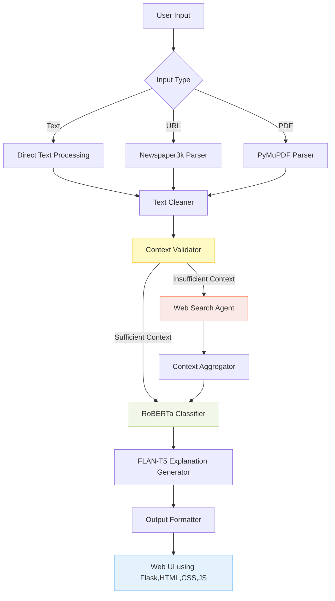

# InformaTruth: AI-Driven News Authenticity Analyzer
InformaTruth is an end-to-end AI-powered multi-agent fact-checking system that automatically verifies news articles, PDFs, and web content. It leverages RoBERTa fine-tuning, LangGraph orchestration, RAG pipelines, and fallback retrieval agents to deliver reliable, context-aware verification. The system features a modular multi-agent architecture including Planner, Retriever, Generator, Memory, and Fallback Agents, integrating diverse tools for comprehensive reasoning.

It achieves ~70% accuracy and F1 ~69% on the LIAR dataset, with 95% query coverage and ~60% improved reliability through intelligent tool routing and memory integration. Designed for real-world deployment, InformaTruth includes a Flask-based responsive UI, FastAPI endpoints, Dockerized containers, and a CI/CD pipeline, enabling enterprise-grade automated fact verification at scale.

[](https://github.com/user-attachments/assets/60bfca60-19bc-404e-9f97-a57ed6f0b5f1)

---

## Live Demo

**Try it now**: [InformaTruth — Fake News Detection AI App](https://informatruth.onrender.com)

---

## Tech Stack
| **Category**                | **Technology/Resource**                                                                                |
| --------------------------- | ------------------------------------------------------------------------------------------------------ |
| **Core Framework**          | PyTorch, Transformers, HuggingFace                                                                     |
| **Classification Model**    | Fine-tuned RoBERTa-base on LIAR Dataset                                                                |
| **Explanation Model**       | FLAN-T5-base (Zero-shot Prompting)                                                                     |
| **Training Data**           | LIAR Dataset (Political Fact-Checking)                                                                 |
| **Evaluation Metrics**      | Accuracy, Precision, Recall, F1-score                                                                  |
| **Training Framework**      | HuggingFace Trainer                                                                                    |
| **LangGraph Orchestration** | LangGraph (Multi-Agent Directed Acyclic Execution Graph)                                               |
| **Agents Used**             | PlannerAgent, InputHandlerAgent, ToolRouterAgent, ExecutorAgent, ExplanationAgent, FallbackSearchAgent |
| **Input Modalities**        | Raw Text, Website URLs (via Newspaper3k), PDF Documents (via PyMuPDF)                                  |
| **Tool Augmentation**       | DuckDuckGo Search API (Fallback), Wikipedia (Planned), ToolRouter Logic                                |
| **Web Scraping**            | Newspaper3k (HTML → Clean Article)                                                                     |
| **PDF Parsing**             | PyMuPDF                                                                                                |
| **Explainability**          | Natural language justification generated using FLAN-T5                                                 |
| **State Management**        | Shared State Object (LangGraph-compatible)                                                             |
| **Deployment Interface**    | Flask (HTML,CSS,JS)                                                                                |
| **Hosting Platform**        | Render (Docker)                                                                  |
| **Version Control**         | Git, GitHub                                                                                            |
| **Logging & Debugging**     | Logs, Print Debugs, Custom Logger                                                 |
| **Input Support**         | Text, URLs, PDF documents                                                             |

---

## Key Features

* **Multi-Format Input Support**
  Accepts raw **text**, **web URLs**, and **PDF documents** with automated preprocessing for each type.

* **Full NLP Pipeline**
  Integrates summarization (optional), **fake news classification** (RoBERTa), and **natural language explanation** (FLAN-T5).

* **Modular Agent-Based Architecture**
  Built using **LangGraph** with modular agents: `Planner`, `Tool Router`, `Executor`, `Explanation Agent`, and `Fallback Agent`.

* **Explanation Generation**
  Uses **FLAN-T5** to generate human-readable, zero-shot rationales for model predictions.

* **Tool-Augmented & Fallback Logic**
  Dynamically queries **DuckDuckGo** when local context is insufficient, enabling robust fallback handling.

* **Clean, Modular Codebase with Logging**
  Structured using clean architecture principles, agent separation, and informative logging.

* **Flask with Web UI**
  User-friendly, interactive, and responsive frontend for input, output, and visual explanations.

* **Dockerized for Deployment**
  Fully containerized setup with `Dockerfile` and `requirements.txt` for seamless deployment.

* **CI/CD with GitHub Actions**
  Automated pipelines for testing, linting, and Docker build validation to ensure code quality and production-readiness.

---

## Project File Structure

```bash
InformaTruth/
│
├── .github/                          # GitHub Actions
│   └── workflows/
│       └── main.yml 
│
├── agents/                           # Modular agents (planner, executor, etc.)
│   ├── executor.py
│   ├── fallback_search.py
│   ├── input_handler.py
│   ├── planner.py
│   ├── router.py
│   └── __init__.py
│
├── fine_tuned_liar_detector/         # Fine-tuned RoBERTa model directory
│   ├── config.json
│   ├── vocab.json
│   ├── tokenizer_config.json
│   ├── special_tokens_map.json
│   ├── model.safetensors
│   └── merges.txt
│
├── liar_dataset/                     # Dataset for fine tune
│   ├── test.tsv
│   ├── train.tsv
│   └── valid.tsv
│
├── graph/                            # LangGraph state and builder logic
│   ├── builder.py
│   ├── state.py
│   └── __init__.py
│
├── models/                           # Classification + LLM model loader
│   ├── classifier.py
│   ├── loader.py
│   └── __init__.py
│
├── news/                             # Sample news or test input
│   └── news.pdf
│
├── notebook/                         # Jupyter notebooks for experimentation
│   └── Experiments.ipynb
│
├── static/                           # Static files (CSS, JS)
│   ├── css/
│   │   └── style.css
│   └── js/
│       └── script.js
│
├── templates/                        # HTML templates for Flask UI
│   ├── dj_base.html
│   └── dj_index.html
│
├── tests/                            # Unit tests
│   └── test_app.py
│
├── train/                            # Training logic
│   ├── config.py
│   ├── data_loader.py
│   ├── predictor.py
│   ├── run.py
│   ├── trainer.py
│   └── __init__.py
│
├── utils/                            # Utilities like logging, evaluation
│   ├── logger.py
│   ├── results.py
│   └── __init__.py
│
├── __init__.py                        
├── app.png                           # Demo
├── demo.webm                         # Demo video
├── app.py                            # Flask app entry point
├── main.py                           # Main script / orchestrator
├── config.py                         # Configuratin file
├── setup.py                          # Project setup for pip install
├── render.yaml                       # Project setup render
├── Dockerfile                        # Docker container spec
├── requirements.txt                  # Python dependencies
├── LICENSE                           # License file
├── .gitignore                        # Git ignore rules
├── .gitattributes                    # Git lfs rules
└── README.md                         # Readme
```

---

## System Architecture


---

## Model Performance
| Epoch | Train Loss | Val Loss | Accuracy | F1     | Precision | Recall  |
|-------|------------|----------|----------|--------|-----------|---------|
| 1     | 0.6353     | 0.6205   | 0.6557   | 0.6601 | 0.6663    | 0.6557  |
| 2     | 0.6132     | 0.5765   | 0.7032   | 0.6720 | 0.6817    | 0.7032  |
| 3     | 0.5957     | 0.5779   | 0.6970   | 0.6927 | 0.6899    | 0.6970  |
| 4     | 0.5781     | 0.5778   | 0.6978   | 0.6899 | 0.6864    | 0.6978  |
| 5     | 0.5599     | 0.5810   | 0.6954   | 0.6882 | 0.6846    | 0.6954  |

> Emphasis on **Recall** ensures the model catches most fake news cases.

---

## Docker Instructions
### Step 1: Build Docker image
```bash
docker build -t informa-truth-app .
```

### Step 2: Run Docker container
```bash
docker run -p 8501:8501 informa-truth-app
```

---

## CI/CD Pipeline (GitHub Actions)
The CI/CD pipeline automates code checks, Docker image building, and Streamlit app validation.

### Sample Workflow
```yaml
name: CI Pipeline
on: [push]
jobs:
  build:
    runs-on: ubuntu-latest
    steps:
      - name: Checkout repo
        uses: actions/checkout@v3

      - name: Setup Python
        uses: actions/setup-python@v4
        with:
          python-version: '3.10'

      - name: Install dependencies
        run: |
          pip install -r requirements.txt
          pip install flake8 pytest

      - name: Run tests
        run: pytest tests/

      - name: Docker build
        run: docker build -t informa-truth-app .
```

---

## **Developed By**

**Md Emon Hasan**  
**Email:** emon.mlengineer@gmail.com
**WhatsApp:** [+8801834363533](https://wa.me/8801834363533)  
**GitHub:** [Md-Emon-Hasan](https://github.com/Md-Emon-Hasan)  
**LinkedIn:** [Md Emon Hasan](https://www.linkedin.com/in/md-emon-hasan-695483237/)  
**Facebook:** [Md Emon Hasan](https://www.facebook.com/mdemon.hasan2001/)

---

## License
MIT License. Free to use with credit.
