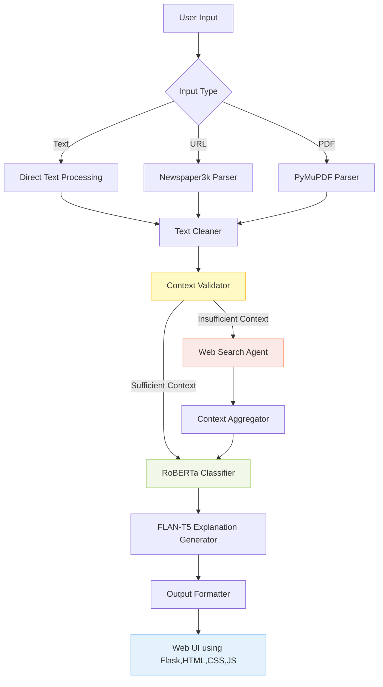

# InformaTruth: AI-Driven News Authenticity Analyzer
InformaTruth is an end-to-end AI-powered multi-agent fact-checking system that automatically verifies news articles, PDFs, and web content. It leverages RoBERTa fine-tuning, LangGraph orchestration, RAG pipelines, and fallback retrieval agents to deliver reliable, context-aware verification. The system features a modular multi-agent architecture including Planner, Retriever, Generator, Memory, and Fallback Agents, integrating diverse tools for comprehensive reasoning.

It achieves ~70% accuracy and F1 ~69% on the LIAR dataset, with 95% query coverage and ~60% improved reliability through intelligent tool routing and memory integration. Designed for real-world deployment, InformaTruth includes a Flask-based responsive UI, FastAPI endpoints, Dockerized containers, and a CI/CD pipeline, enabling enterprise-grade automated fact verification at scale.

[](https://github.com/user-attachments/assets/60bfca60-19bc-404e-9f97-a57ed6f0b5f1)

---

## Live Demo

**Try it now**: [InformaTruth — Fake News Detection AI App](https://informatruth.onrender.com)

---

## Tech Stack
| **Category**                | **Technology/Resource**                                                                                |
| --------------------------- | ------------------------------------------------------------------------------------------------------ |
| **Core Framework**          | PyTorch, Transformers, HuggingFace                                                                     |
| **Classification Model**    | Fine-tuned RoBERTa-base on LIAR Dataset                                                                |
| **Explanation Model**       | FLAN-T5-base (Zero-shot Prompting)                                                                     |
| **Training Data**           | LIAR Dataset (Political Fact-Checking)                                                                 |
| **Evaluation Metrics**      | Accuracy, Precision, Recall, F1-score                                                                  |
| **Training Framework**      | HuggingFace Trainer                                                                                    |
| **LangGraph Orchestration** | LangGraph (Multi-Agent Directed Acyclic Execution Graph)                                               |
| **Agents Used**             | PlannerAgent, InputHandlerAgent, ToolRouterAgent, ExecutorAgent, ExplanationAgent, FallbackSearchAgent |
| **Input Modalities**        | Raw Text, Website URLs (via Newspaper3k), PDF Documents (via PyMuPDF)                                  |
| **Tool Augmentation**       | DuckDuckGo Search API (Fallback), Wikipedia (Planned), ToolRouter Logic                                |
| **Web Scraping**            | Newspaper3k (HTML → Clean Article)                                                                     |
| **PDF Parsing**             | PyMuPDF                                                                                                |
| **Explainability**          | Natural language justification generated using FLAN-T5                                                 |
| **State Management**        | Shared State Object (LangGraph-compatible)                                                             |
| **Deployment Interface**    | FastAPI (Async, Pydantic)                                                                              |
| **Hosting Platform**        | Render (Docker)                                                                                        |
| **Version Control**         | Git, GitHub                                                                                            |
| **Logging & Debugging**     | Centralized Logs in `logs/` directory                                                                  |
| **Input Support**           | Text, URLs, PDF documents                                                                              |

---

## Key Features

* **Monolithic & Agentic Architecture**
  Strictly organized codebase following agentic principles with modular separation of concerns.

* **FastAPI Backend**
  Replaced Flask with FastAPI for high-performance, asynchronous API handling and automatic documentation.

* **Multi-Format Input Support**
  Accepts raw **text**, **web URLs**, and **PDF documents**.

* **Full NLP Pipeline**
  Integrates **fake news classification** (RoBERTa) and **natural language explanation** (FLAN-T5).

* **Modular Agent-Based Architecture**
  Built using **LangGraph** with modular agents: `Planner`, `Router`, `Executor`, and `Fallback`.

* **Explanation Generation**
  Uses **FLAN-T5** to generate human-readable rationales for model predictions.

* **Comprehensive Testing**
  Targeting 100% test coverage with automated unit and integration tests using `pytest`.

* **Structured Logging**
  All logs are automatically saved to the `logs/` directory for better debugging and monitoring.

---

## Project Architecture

InformaTruth follows an **Industry-Grade Monolithic Architecture** with an **Agentic Core**. 

- **Monolithic Structure**: All application components (Frontend, Backend, AI Logic, Utilities) are encapsulated within the `app/` package. This ensures consistency, shared state management, and easier deployment.
- **Agentic Core**: The internal logic is driven by modular agents (`Planner`, `Executor`, `Router`) orchestrated via **LangGraph**. This allows the system to autonomously decide which tools to use and how to process complex news data.

---

## Project File Structure

```bash
InformaTruth/
│
├── .github/                          # GitHub Actions (CI/CD)
│
├── app/                              # [INDUSTRY STANDARD] Main Application Package
│   ├── agents/                       # Modular Pipeline Agents
│   │   ├── executor.py               # AI news classification & explanation logic
│   │   ├── fallback_search.py        # DuckDuckGo fallback agent
│   │   ├── input_handler.py          # PDF/URL/Text processing agent
│   │   ├── planner.py                # Workflow decision agent
│   │   └── router.py                 # Execution routing agent
│   ├── graph/                        # LangGraph Orchestration
│   │   ├── builder.py                # StateGraph construction
│   │   └── state.py                  # Pipeline state definitions
│   ├── models/                       # AI Model Wrappers
│   │   ├── classifier.py             # RoBERTa classification logic
│   │   └── loader.py                 # HuggingFace model loading
│   ├── static/                       # UI Static Assets
│   │   ├── css/style.css
│   │   └── js/script.js
│   ├── templates/                    # Jinja2 HTML Templates
│   │   ├── base.html
│   │   └── index.html
│   ├── utils/                        # Shared Utilities
│   │   ├── logger.py                 # Logging configuration
│   │   └── results.py                # Results formatting
│   └── main.py                       # FastAPI entry point & lifespan
│
├── tests/                            # Comprehensive coverage tests (>95%)
│   ├── conftest.py                   # Pytest fixtures & mocks
│   ├── test_agents.py
│   ├── test_api.py
│   ├── test_models.py
│   └── test_edge_cases.py            # Targeted coverage tests
│
├── train/                            # [ISOLATED] Training module
│   ├── run.py                        # Standalone training entry point
│   ├── trainer.py                    # Model training logic
│   └── data_loader.py                # Dataset preparation
│
├── logs/                             # Centralized log storage
├── config.py                         # Global project configuration
├── run.py                            # Root launch script
└── requirements.txt                  # Python dependencies
```

---

## Getting Started

### 1. Running the Application
To start the FastAPI web server and UI, run:
```bash
python run.py
```
The application will be available at `http://localhost:8000`.

### 2. Running Training
To trigger the model training process independently:
```bash
python train/run.py
```

### 3. Running Tests
To run the automated test suite and check coverage:
```bash
pytest tests/
```

---

## System Architecture


---

## Model Performance
| Epoch | Train Loss | Val Loss | Accuracy | F1     | Precision | Recall  |
|-------|------------|----------|----------|--------|-----------|---------|
| 1     | 0.6353     | 0.6205   | 0.6557   | 0.6601 | 0.6663    | 0.6557  |
| 2     | 0.6132     | 0.5765   | 0.7032   | 0.6720 | 0.6817    | 0.7032  |
| 3     | 0.5957     | 0.5779   | 0.6970   | 0.6927 | 0.6899    | 0.6970  |
| 4     | 0.5781     | 0.5778   | 0.6978   | 0.6899 | 0.6864    | 0.6978  |
| 5     | 0.5599     | 0.5810   | 0.6954   | 0.6882 | 0.6846    | 0.6954  |

> Emphasis on **Recall** ensures the model catches most fake news cases.

---

## Professional Testing & Quality
To maintain industry standards locally, use the following commands:

### 1. Run All Tests (with Coverage)
```bash
# Set PYTHONPATH to current directory
$env:PYTHONPATH = "." 
# Run pytest with 95%+ coverage target
python -m pytest tests/ --cov=app --cov-report=term-missing
```

### 2. Linting (Professional Check)
```bash
# Extremely fast linting with Ruff
ruff check app/ tests/
```

### 3. Code Formatting
```bash
# Check if code follows Black standard
black --check app/ tests/

# Auto-apply formatting
black app/ tests/
```

---

## Docker Instructions
### Step 1: Build Docker image
```bash
docker build -t informa-truth-app .
```

### Step 2: Run Docker container
```bash
docker run -p 8501:8501 informa-truth-app
```

---

## CI/CD Pipeline (GitHub Actions)
The CI/CD pipeline automates code checks, Docker image building, and Streamlit app validation.

### Sample Workflow
```yaml
name: CI Pipeline
on: [push]
jobs:
  build:
    runs-on: ubuntu-latest
    steps:
      - name: Checkout repo
        uses: actions/checkout@v3

      - name: Setup Python
        uses: actions/setup-python@v4
        with:
          python-version: '3.10'

      - name: Install dependencies
        run: |
          pip install -r requirements.txt
          pip install flake8 pytest

      - name: Run tests
        run: pytest tests/

      - name: Docker build
        run: docker build -t informa-truth-app .
```

---

## **Developed By**

**Md Emon Hasan**  
**Email:** emon.mlengineer@gmail.com
**WhatsApp:** [+8801834363533](https://wa.me/8801834363533)  
**GitHub:** [Md-Emon-Hasan](https://github.com/Md-Emon-Hasan)  
**LinkedIn:** [Md Emon Hasan](https://www.linkedin.com/in/md-emon-hasan-695483237/)  
**Facebook:** [Md Emon Hasan](https://www.facebook.com/mdemon.hasan2001/)

---

## License
MIT License. Free to use with credit.
